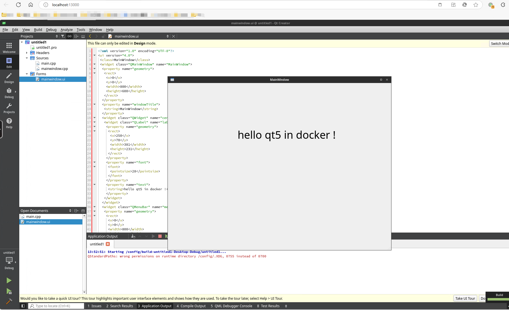
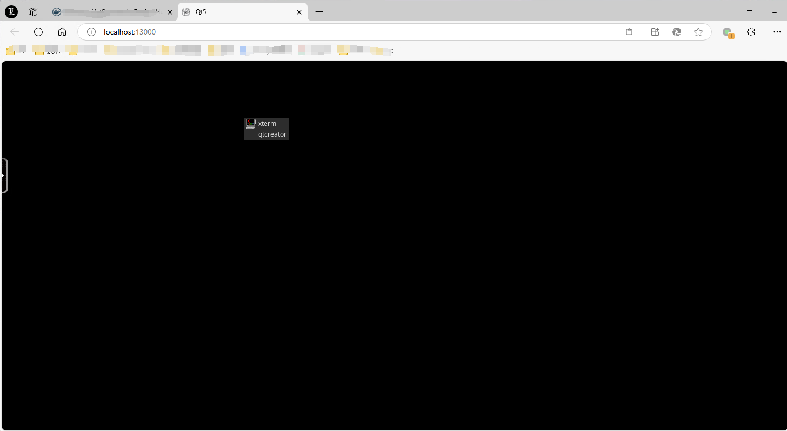

#### 说明:
> 这是基于 https://github.com/linuxserver/docker-baseimage-kasmvnc 构建的qt5开发环境

> 基于 debian 12 包含完整的桌面环境

> 已安装 qt5 相关库
   qtbase5-dev 
   qt5-qmake 
   build-essential 
   libqt5widgets5 
   libqt5gui5 
   libqt5network5 
   libqt5serialport5
   libqt5charts5 

> 已安装 qtcreator 开发工具

#### 自构建及修改

修改 Dockerfile 即可

使用 下述语句构建即可

```cmd
docker build --no-cache --pull -t homepanda.mynetgear.com/qt5:20241218 .
```

#### 运行:
- docker-hub 已有构建的 https://hub.docker.com/r/kensouwj/qt5

- 新建文件夹 qt5config 用于 配置保存以及与容器的数据传输

- 新建docker-compose.yaml 拷贝下面 语句即可启动

```yml
services:
  qt5-in-dokcer:
    image: kensouwj/qt5:latest
    container_name: qt5-in-dokcer
    security_opt:
      - seccomp:unconfined #optional
    environment:
      - PUID=1000
      - PGID=1000
      - TZ=Asia/Shanghai
      - CHROME_CLI=https://www.linuxserver.io/ #optional
    volumes:
      - ./qt5config:/config
    ports:
      - 13000:3000
      - 13001:3001
    shm_size: "5gb"
    restart: unless-stopped
```

> enjoy！

[](测试界面)

tips:
 启动脚本异常，可以右键点击 qtcreator 自启动即可
[](启动)
